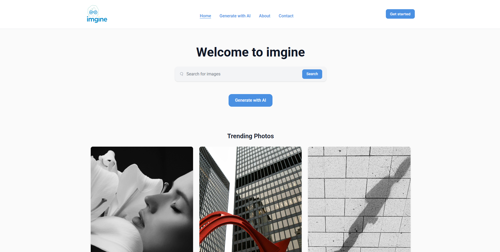
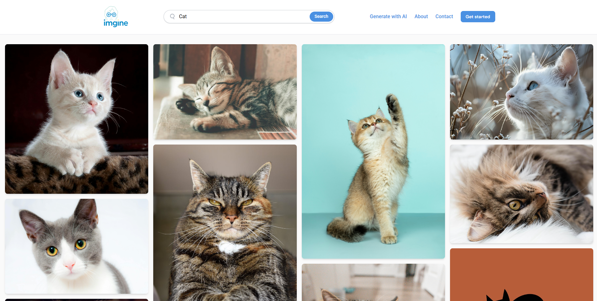
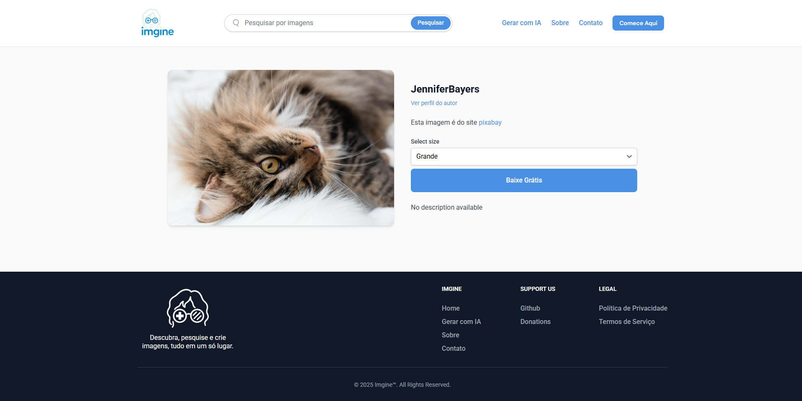

# 🖼️ Imgine

**PT-BR**: Plataforma inteligente de busca e geração de imagens que reúne os melhores bancos gratuitos da internet em um só lugar.

**EN**: Smart image search and generation platform that unifies the best free image banks on the internet in one place.

🌐 Acesse a plataforma: [https://www.imgine.com.br](https://www.imgine.com.br)

---

## 📸 Demonstração

### Prints // Screenshots





---

## ⚙️ Funcionalidades | Features

### 🇧🇷

-   🔍 Busca de imagens unificada em múltiplos bancos gratuitos (Pexels, Unsplash, Pixabay)
-   🖼️ Exibição em grade responsiva com carregamento por paginação
-   🌐 Suporte multilíngue (Português e Inglês)
-   👤 Visualização detalhada de cada imagem com autor, dimensões e opções de download
-   📩 Formulário de contato funcional
-   💡 Geração de imagens por IA (em breve)
-   💰 Página de doações com suporte a criptomoedas

### 🇺🇸

-   🔍 Unified image search across multiple free sources (Pexels, Unsplash, Pixabay)
-   🖼️ Responsive grid layout with pagination
-   🌐 Multilingual support (Portuguese and English)
-   👤 Image detail view with author info, dimensions, and download options
-   📩 Working contact form
-   💡 AI image generation (coming soon)
-   💰 Donation page with crypto support

---

## 🛠 Tecnologias utilizadas | Technologies Used

-   **Laravel** – Framework PHP para backend robusto / Robust PHP backend framework
-   **Tailwind CSS** – Estilização moderna e responsiva / Modern utility-first CSS
-   **Flowbite** – Componentes UI com Tailwind / Tailwind UI components
-   **Vite** – Build rápido para frontend / Lightning-fast frontend bundler
-   **Blade** – Engine de templates do Laravel / Laravel’s native template engine
-   **Pexels API, Unsplash API, Pixabay API** – Fontes de imagens / Image providers
-   **PHP 8+**, **Composer**, **npm**

> 🚀 Projeto open-source com foco em performance, acessibilidade e escalabilidade.  
> 🚀 Open-source project focused on performance, accessibility, and scalability.

---

## 🧲 Instalação local | Local Installation

### 🇧🇷

1. Clone o repositório:

    ```bash
    git clone https://github.com/seu-usuario/imgine.git
    cd imgine
    ```

2. Instale as dependências PHP:

    ```bash
    composer install
    ```

3. Copie o arquivo `.env` e configure suas variáveis:

    ```bash
    cp .env.example .env
    php artisan key:generate
    ```

4. Configure o banco de dados e execute as migrations:

    ```bash
    php artisan migrate
    ```

5. Instale as dependências do frontend e compile os assets:

    ```bash
    npm install
    npm run dev
    ```

6. Inicie o servidor local:

    ```bash
    php artisan serve
    ```

> Acesse em [http://localhost:8000](http://localhost:8000)

---

### 🇺🇸

1. Clone the repository:

    ```bash
    git clone https://github.com/your-username/imgine.git
    cd imgine
    ```

2. Install PHP dependencies:

    ```bash
    composer install
    ```

3. Copy `.env` file and generate the app key:

    ```bash
    cp .env.example .env
    php artisan key:generate
    ```

4. Set up your database and run migrations:

    ```bash
    php artisan migrate
    ```

5. Install frontend dependencies and build assets:

    ```bash
    npm install
    npm run dev
    ```

6. Start the local server:

    ```bash
    php artisan serve
    ```

> Open in [http://localhost:8000](http://localhost:8000)

---

## 🤝 Como contribuir | How to Contribute

### 🇧🇷

1. Faça um fork do projeto
2. Crie sua branch com a feature:

    ```bash
    git checkout -b minha-feature
    ```

3. Commit suas alterações:

    ```bash
    git commit -m 'feat: nova funcionalidade'
    ```

4. Dê push na sua branch:

    ```bash
    git push origin minha-feature
    ```

5. Abra um Pull Request ✨

### 🇺🇸

1. Fork this repository
2. Create a branch for your feature:

    ```bash
    git checkout -b my-feature
    ```

3. Commit your changes:

    ```bash
    git commit -m 'feat: add new feature'
    ```

4. Push the branch:

    ```bash
    git push origin my-feature
    ```

5. Open a Pull Request ✨

> Todas as contribuições são bem-vindas! | All contributions are welcome!
